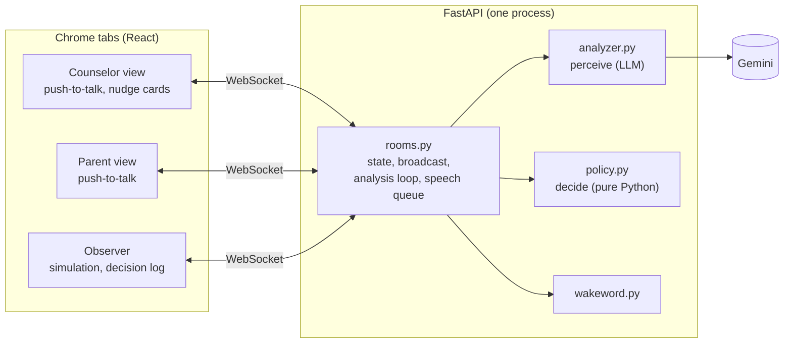

# Beacon

Beacon is a real-time AI mediator for financial aid calls between a counselor and a
first-generation college family. It listens, notices when the parent's words show a
misunderstanding or when jargon went by unexplained, nudges the counselor privately, and only if
the counselor moves on does it ask, out loud and on the family's behalf, the question the family
won't ask. After the call it produces a plain-language Family Recap that can be read aloud.

Beacon: a light that guides people through unclear waters. It helps the family see what the call actually means.
"Beacon" is the wake word.

All people, the school, and the award letter are fictional; amounts are illustrative.

## Quick start

1. Get a free Gemini API key at [Google AI Studio](https://aistudio.google.com/apikey).
2. `cp .env.example .env` and set `GEMINI_API_KEY`.
3. Install and run (Python 3.11+, Node 20.19+ or 22.12+, Chrome):

   | macOS / Linux | Windows (no make) |
   |---|---|
   | `make install` | `python tasks.py install` |
   | `make build` | `python tasks.py build` |
   | `make run` | `python tasks.py run` |

4. Open (Chrome):
   - Counselor: <http://localhost:8000/call?room=demo&role=counselor>
   - Parent: <http://localhost:8000/call?room=demo&role=parent>
   - Observer: <http://localhost:8000/observer?room=demo>

Other commands: `make dev` (FastAPI with reload on :8000 + Vite on <http://localhost:5173>,
same paths), `make test`, `make eval` (`make eval ARGS=--cache` to reuse cached LLM responses).
Without a key the app still runs, but nothing reaches Gemini: the status shows "analyzer
unavailable", no nudges appear, Beacon says only its opening line plus "Sorry, I couldn't look
that up just now" to a summon, and after **End call** the recap reads "The Family Recap could not
be generated."

## Run it LIVE as one person

1. Open the counselor and parent URLs in two Chrome windows side by side (and the observer in a
   third if you like). Chrome asks for the microphone the first time you push to talk, not when
   the page opens; allow it once and it is remembered for the site.
2. In the counselor window, click **Start call**. Beacon introduces itself.
3. In the window of whoever is speaking, hold **Hold to talk** (or hold the spacebar), say the
   line, release. You can also type a line instead; typing works without a microphone. Click
   once in each window first: Chrome only lets a tab play speech after you've interacted with it.
4. Try the planted moments yourself, e.g. counselor: "Daniel's total aid package is $31,500."
   Parent: "Oh, thank goodness, so it's covered." A card appears in the counselor window. Once
   it's there, say something unrelated as the counselor and Beacon asks about it at the next
   pause.
5. Say "Beacon, what's a Parent PLUS loan?" as the parent. Summons work best starting with a
   question word ("Beacon, what...", "Beacon, how...", "Beacon, can you...").
6. Click **End call** to get the Family Recap.

Only the counselor window plays Beacon's voice by default (the "Play Beacon audio here"
toggle, remembered per role in this browser), so one laptop doesn't play it twice.

## Run a SIMULATION

Open the observer, pick `demo_call` (planted misunderstandings) or `control_call` (a clean call),
and press **Play**. The observer sends each scripted line to the server and waits until the
analysis of that line is done and Beacon has finished anything it decided to say before the next
line. The pipeline is exactly the one used live. "Text only (no audio)" is ticked by default for a
fast silent run; untick it to hear Alex, Maria and Beacon in distinct voices (the observer plays
every voice; call tabs stay silent during a simulation). Text-only runs compress time, so a later
interjection can fall inside the 20 s cooldown and go to the recap instead of being spoken (see
DECISIONS.md); runs with audio keep real conversational timing. Open the counselor window
alongside to see the nudge cards.

## Manual test checklist (microphone and speakers can't be tested automatically)

- [ ] Chrome asks for microphone permission on the first push-to-talk; after allowing, your
      words appear greyed out while you hold, then as a turn when you release.
- [ ] Push-to-talk works in both call windows, with the button and with the spacebar (and the
      spacebar still types spaces in the text box). While one person holds it, the other
      window shows "Alex is talking…" / "Maria is talking…".
- [ ] Holding past a natural pause keeps listening (Chrome stops recognition on its own; it is
      restarted while the key is held).
- [ ] "Beacon, what's a Parent PLUS loan?" spoken as the parent gets a spoken answer; "can of
      peas" and "campus" do not.
- [ ] While Beacon speaks, push-to-talk is disabled in every tab and "Beacon is speaking" shows.
- [ ] "Play Beacon audio here" on in the counselor tab only: you hear Beacon once. Turn it on in
      the parent tab too: you hear it twice. Turn all off: the call continues (no audio). Then
      set it back (counselor only); the choice is remembered per role in this browser.
- [ ] Simulation with "Text only" unchecked: Alex, Maria and Beacon have distinct voices, and
      the call tabs stay silent.
- [ ] After **End call**, the recap appears in every view; **Read aloud** speaks it and
      **Download .md** saves it.

## Architecture

### Perceive vs. decide

The LLM never makes Beacon speak. After each relevant turn, `analyzer.analyze()` sends Gemini the
whole transcript (with turn ids, speakers and pauses), the award letter and glossary, the existing
flags and the open questions, and gets back structured JSON: possible misunderstandings with exact
quotes, which open flags the counselor has resolved, and which parent questions were asked and
answered. `policy.py`, plain deterministic Python, then decides:

- **Evidence gate:** every quote must actually appear in the turn it cites (fuzzy match), and a
  parent turn must be cited. Otherwise the flag is dropped and logged. Confidence scores are not
  used.
- **Dedupe** by `issue_key`.
- **Severity:** `recap` flags never interrupt; they go to the recap.
- **Unanswered questions** are counted by code, not judged by the LLM.
- **Escalation ladder**, cooldown and staleness (below).

### Escalation ladder

1. **Nudge:** a private card in the counselor's tab: what seems misunderstood and a suggested
   clarification. The parent sees nothing.
2. **Check:** each later analysis reports whether the counselor resolved it → `resolved`, silent.
3. **Speak:** after `ESCALATE_AFTER_COUNSELOR_TURNS` counselor turns without a fix, Beacon asks
   at the next pause (nobody holding push-to-talk, 700 ms of quiet) → `spoken`.
4. **Stale:** if more than `STALE_AFTER_TURNS` turns have passed by the time it could speak (for
   example because of the 20 s cooldown), it goes to the recap instead → `recap`.

Every transition is logged with a reason in the observer's Decision Log and in
`logs/<room>-<time>.jsonl`. All thresholds are in `backend/app/config.py` and can be overridden
by environment variables.

### Where things are

| File | What it does |
|---|---|
| `backend/app/policy.py` | every decision (start here) |
| `backend/app/rooms.py` | WebSocket rooms, analysis loop, speech queue, timing |
| `backend/app/analyzer.py` | prompts in, validated JSON out |
| `backend/app/models.py` + `web/src/types.ts` | data shapes and the WebSocket protocol (change both together) |
| `backend/app/llm.py` | Gemini wrapper (throttle, backoff, cache) and the FakeLLM used in tests |
| `backend/app/wakeword.py`, `docs.py`, `main.py` | wake word; grounding documents with line ids; FastAPI routes |
| `backend/tests/` | pytest unit and WebSocket smoke tests (no network) |
| `data/` | award letter, glossary, demo and control scripts |
| `backend/prompts/*.txt` | the analyzer, summon and recap prompts |
| `backend/app/triggers.py` | the one list of triggers |
| `backend/app/config.py` | every tunable |
| `web/src/` | React views, WebSocket hook, speech helpers, simulation runner |
| `eval/run.py` | offline eval → `eval_results.md` |
| `DECISIONS.md` | why things are the way they are |

## Limitations

- Prototype: one process, in-memory rooms, no authentication, no persistence beyond log files.
- Chrome only (Web Speech API). Push-to-talk turns, not continuous listening or diarization.
- Response timing (`gap_ms`) uses each tab's clock; fine on one machine, skewed across machines.
- The analyzer can miss things or misjudge severity; the design makes misses cheap (the recap
  catches them) and false interruptions rare (evidence gate, nudge first, cooldown).
- The free-tier rate limit caps how fast analyses can run; calls are spaced 4 s apart.

## Next steps

- Phone integration (telephony audio in, a counselor-side app).
- A counselor-only whisper mode (cards only, Beacon never speaks).
- Multilingual support: clarify and recap in the family's language.
- Testing with real counselors and families to tune when Beacon should speak.
