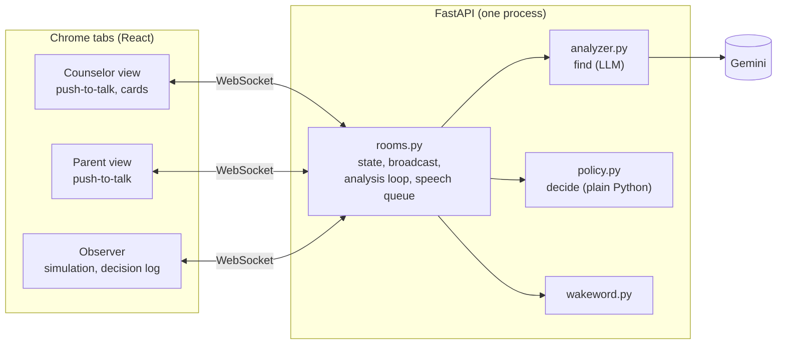

# Beacon

Beacon listens to a financial aid call between a counselor and a first-generation college
family. It asks the question the family won't ask.

When the parent's words show a misunderstanding, Beacon first shows the counselor a private card.
If the counselor clarifies, Beacon stays silent. If the counselor moves on, Beacon waits for a
pause and asks aloud, on the family's behalf. The family can also ask Beacon directly ("Beacon,
what's a Parent PLUS loan?"). After the call, Beacon writes a plain-language Family Recap that it
can read aloud.

*A real Gemini result. Maria hears "$31,500 in aid" as "it's covered". Only Alex sees the card.*

All people, the school and the award letter are fictional. The amounts are illustrative.

## Quick start

You need Python 3.11+, Node 20.19+ (or 22.12+) and Chrome.

1. Get a free Gemini API key at [Google AI Studio](https://aistudio.google.com/apikey).
2. Copy `.env.example` to `.env`, and set `GEMINI_API_KEY` in it.
3. Install, build and run:

   | macOS / Linux | Windows |
   |---|---|
   | `make install` | `python tasks.py install` |
   | `make build` | `python tasks.py build` |
   | `make run` | `python tasks.py run` |

4. Open these pages in Chrome:
   - Observer (start here): <http://localhost:8000/observer?room=demo>
   - Counselor: <http://localhost:8000/call?room=demo&role=counselor>
   - Parent: <http://localhost:8000/call?room=demo&role=parent>

Without a key, the app runs, but Beacon cannot analyze the call. The status shows "analyzer
unavailable".

Other commands: `make dev` (server with reload, and Vite on <http://localhost:5173>), `make test`
(unit and WebSocket tests, no network), `make eval` (the offline eval, see "Does it work?").

## Try it

### Watch a scripted call (easiest)

1. Open the observer, and the counselor window next to it.
2. Keep `demo_short` selected and click **Play**.

The observer sends a scripted call to the server, one line at a time, through the same pipeline
as a live call. Watch the private cards appear in the counselor window, Beacon's questions in the
transcript, and every decision in the Decision Log. Hover over a card in the observer to highlight
its evidence in the transcript and the award letter. At the end, the Family Recap appears.

"Text only" is ticked by default: a silent run that waits on each line long enough to read it.
Untick it to hear Alex, Maria and Beacon in different voices. `demo_call` is a longer call with
more moments, and `control_call` is a clear call where Beacon should stay quiet.

### Run a live call yourself

1. Open the counselor and parent windows side by side, and click once in each (Chrome plays
   speech only in a page that you clicked).
2. In the counselor window, click **Start call**. Beacon introduces itself.
3. To speak a turn, hold **Hold to talk** (or the spacebar), speak, and release. Or type the turn
   and press Enter.
4. As the counselor, say "Daniel's total aid package is $31,500." As the parent, say "Oh, thank
   goodness, so it's covered." A card appears in the counselor window.
5. As the counselor, say something unrelated. Beacon asks about the card at the next pause.
6. As the parent, say "Beacon, what's a Parent PLUS loan?"
7. Click **End call** to get the Family Recap.

Only the counselor window plays Beacon's voice, so one laptop does not play it twice. If you play
both roles, the time you take to change windows looks like hesitation to Beacon. Add
`NOTABLE_GAP_MS=6000` to `.env` to allow for it.

## How it works

The browser turns each push-to-talk turn into text and sends it to the server, with the pause
before it.

### Gemini finds; Python decides

After each relevant turn, Gemini gets the full transcript (with pauses), the award letter, the
glossary, and the open cards. It returns structured JSON: possible misunderstandings with exact
quotes, the cards that the counselor has cleared up, and the parent's questions.

Gemini never makes Beacon speak. `policy.py`, plain deterministic Python, decides what happens:

- **Evidence check.** Each quote must really appear in the turn it cites, and a parent turn must
  be cited. If not, the card is dropped and the log says why.
- **No duplicates.** One card per issue, and one card per moment.
- **Severity.** Minor issues never interrupt. They go to the recap.
- **Unanswered questions.** Code, not the LLM, counts the counselor turns after a question.

### When Beacon speaks

1. **Nudge.** A private card tells the counselor what seems misunderstood and suggests a
   clarification. The parent sees nothing.
2. **Check.** Each later analysis reports whether the counselor cleared it up. If so, Beacon stays
   silent.
3. **Speak.** If the counselor starts a new turn without clarifying, Beacon asks one short
   question at the next pause (nobody holds push-to-talk, and 0.7 s is quiet). If someone starts
   talking first, Beacon drops the line and decides again after the next turn. Beacon waits at
   least 20 s between two questions.
4. **Recap.** If Beacon cannot ask in time (more than 3 turns later), the issue goes to the recap.

An unanswered parent question gets a card after 2 counselor turns, and Beacon asks after the
third. All thresholds are in `backend/app/config.py`, and an environment variable with the same
name overrides each one.

### The counselor stays in control

Each card has two buttons that only the counselor sees:

- **I'll clarify:** Beacon waits one more counselor turn before it can ask.
- **Not an issue:** Beacon never speaks about it. An unanswered question from the family still
  goes to the recap.

Each click is logged with the card, as labeled examples for tuning Beacon later.

### Answers and the recap

"Beacon, what's…?" starts a question to Beacon. It answers only from the award letter and the
glossary, cites the lines it used, and says so when the answer is not in the documents. After the
call, Gemini writes the Family Recap: free money, loans, work-study, what is left to pay,
deadlines and open questions. Code checks that each number in the recap appears in the lines it
cites.

### Where things are

| File | What it does |
|---|---|
| `backend/app/policy.py` | every decision (start here) |
| `backend/app/rooms.py` | WebSocket rooms, analysis loop, speech queue, timing |
| `backend/app/analyzer.py` | prompts in, checked JSON out |
| `backend/prompts/*.txt` | the analyzer, question and recap prompts |
| `backend/app/triggers.py` | the kinds of misunderstanding that Beacon looks for |
| `backend/app/models.py`, `web/src/types.ts` | data shapes and the WebSocket messages |
| `backend/app/llm.py` | Gemini client, and a fake LLM for tests |
| `backend/app/wakeword.py` | finds "Beacon" in a turn |
| `backend/app/config.py` | all settings |
| `data/` | award letter, glossary, scripted calls |
| `web/src/` | React views, speech, simulation runner |
| `backend/tests/` | unit and WebSocket tests |
| `eval/run.py` | the offline eval, writes `eval_results.md` |

## Does it work?

The eval replays scripted calls through the real analyzer and decision code, and checks each
planted moment: did Beacon flag it, stay quiet, or ask aloud, as expected? It ran once per script
with `gemini-3.5-flash-lite` on 2026-10-09, with 0 errors.

| Script | What it tests | Result |
|---|---|---|
| `demo_call` | 7 planted moments (misreadings, unexplained jargon, an ignored question, a question to Beacon, correct restatements) and 1 moment that must stay quiet | 7/7, quiet moment quiet |
| `demo_call_stt_noise` | the same call as Chrome transcribes it: lowercase, no question marks, misheard words | 7/7, quiet moment quiet |
| `control_call` | a clear call with nothing planted | nothing spoken, 1 private card |
| `adversarial_clean` | a clear call with near misses: correct restatements, jargon explained at once, a pause before "okay" | no cards, nothing spoken |
| `live_regressions` | failures found in live testing | 3/3 |
| `live_patterns` | a relapse after a correction, a reply split over three turns, two misreadings in a row, "never mind" | 7/7 |
| `summon_checks` | 10 questions to Beacon, 2 of them not answered by the documents | 10/10 |

`demo_short`, the shortened call for the demo video, was added after this run. Full transcripts
and every decision are in [`eval_results.md`](eval_results.md).

The eval analyzes each turn before the next one arrives. So it measures what Beacon finds and
decides, not live timing.

## Next steps

- Phone integration: telephony audio in, and an app for the counselor.
- More languages: clarifications and the recap in the family's language.
- Any school's documents, through retrieval instead of one fixed award letter.
- Tests with real counselors and families, to tune when Beacon speaks.
