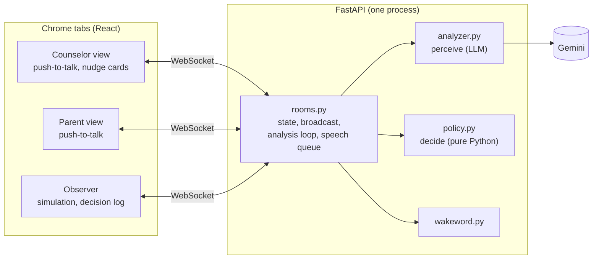

# Beacon

Beacon listens to a financial aid call between a counselor and a first-generation college
family. It asks the question the family won't ask.

When the parent's words show a misunderstanding, Beacon first shows the counselor a private card.
If the counselor clarifies, Beacon stays silent. If the counselor moves on, Beacon waits for a
pause and asks aloud, on the family's behalf. After the call, Beacon writes a plain-language
Family Recap that it can read aloud.

*A real Gemini result. Maria hears "$31,500 in aid" as "it's covered". Only Alex sees the card.*

Beacon is a light that guides people through unclear waters. "Beacon" is also the wake word. All
people, the school and the award letter are fictional. The amounts are illustrative.

## Does it work?

The eval replays scripted calls through the real analyzer and policy.

Each script ran once in lock-step mode with `gemini-3.5-flash-lite` on 2026-10-09, after the
escalation-ladder fixes and with the stricter grading (a summon must cite an expected document
line, a spoken line must be about the moment, the trigger must match): 0 errors.

| Script | What it tests | Result |
|---|---|---|
| `demo_call` | 7 planted moments (misreadings, unexplained jargon, an ignored question, a summon, correct restatements) and 1 moment that must stay quiet | 7/7, and the quiet moment stayed quiet |
| `demo_call_stt_noise` | the same call as Chrome transcribes it: lowercase, no question marks, mis-heard words | 7/7, quiet moment quiet |
| `control_call` | a clear call with nothing planted | 0 spoken interjections, 1 private card (resolved on the next analysis) |
| `adversarial_clean` | correct restatements, jargon explained at once, "mm-hm" after logistics, a pause before "okay" | 0 cards, 0 spoken |
| `live_regressions` | failures from live testing, replayed | 3/3 |
| `live_patterns` | a relapse after a correction, a reply split over three presses, two misreads back to back, "never mind", a pause after logistics | 7/7 |
| `summon_checks` | 10 questions to Beacon, 2 of them outside the documents | 10/10 |

One run is less than the 3 runs per script of earlier rounds (see the tuning log). **Paced mode
has no results yet:** the free tier's daily quota ran out during its first script.

Full transcripts and every decision: [`eval_results.md`](eval_results.md). Each tuning step and
its before-and-after numbers: the "Tuning log" in [`DECISIONS.md`](DECISIONS.md). 66 unit and
WebSocket tests run without network access.

The eval has two modes. **Lock-step** (the default) analyzes every turn before the next one
arrives: it measures perception, and its numbers compare across rounds. **Paced** (`--paced`)
replays the live pipeline's timing on a virtual clock: turns keep arriving while the LLM works,
and Beacon's line is withdrawn when someone starts talking first. It shows how often Beacon
actually gets the floor. `eval_results.md` shows both side by side.

## Quick start

You need Python 3.11+, Node 20.19+ (or 22.12+) and Chrome.

1. Get a free Gemini API key at [Google AI Studio](https://aistudio.google.com/apikey).
2. Copy `.env.example` to `.env`.
3. In `.env`, set `GEMINI_API_KEY`.
4. Install, build and run:

   | macOS / Linux | Windows (no make) |
   |---|---|
   | `make install` | `python tasks.py install` |
   | `make build` | `python tasks.py build` |
   | `make run` | `python tasks.py run` |

5. Open these pages in Chrome:
   - Counselor: <http://localhost:8000/call?room=demo&role=counselor>
   - Parent: <http://localhost:8000/call?room=demo&role=parent>
   - Observer: <http://localhost:8000/observer?room=demo>

Other commands:

- `make dev`: FastAPI with reload on :8000, and Vite on <http://localhost:5173> (same paths).
- `make test`: the unit and WebSocket tests.
- `make eval`: the eval. `make eval ARGS=--cache` reuses cached LLM responses, and
  `make eval ARGS=--paced` runs the paced mode.

Without a key, the app runs but sends nothing to Gemini. The status shows "analyzer unavailable".
Beacon says its opening line, and answers a summon with "Sorry, I couldn't look that up just
now". After **End call**, the recap reads "The Family Recap could not be generated."

## Run a live call as one person

1. Open the counselor window and the parent window side by side. You can also open the observer
   in a third window.
2. Click once in each window. Chrome plays speech only in a page that you clicked.
3. In the counselor window, click **Start call**. Beacon introduces itself.
4. To speak a turn, hold **Hold to talk** (or the spacebar) in the speaker's window. Say the
   line, then release. Chrome asks for the microphone at your first push-to-talk; allow it.
5. To type a turn instead, write it in the text box and press Enter. Typing needs no microphone.
6. Try a planted moment. As the counselor, say "Daniel's total aid package is $31,500." As the
   parent, say "Oh, thank goodness, so it's covered."
7. Look for the card in the counselor window. Then say something unrelated as the counselor.
   Beacon asks about the card at the next pause.
8. As the parent, say "Beacon, what's a Parent PLUS loan?" Start a summon with a question word:
   "Beacon, what...", "Beacon, how...", "Beacon, can you...".
9. Click **End call** to get the Family Recap.

Start each test from a clean call: click **End call**, then **Start call**. Old test turns stay
in the transcript that the analyzer reads.

Only the counselor window plays Beacon's voice by default, so one laptop does not play it twice.
The "Play Beacon audio here" switch changes this. Each browser remembers it per role.

**Playing both roles yourself?** Beacon measures the pause before each turn. The pause runs from
the end of the previous turn to the next push-to-talk press. For spoken turns, the server
subtracts `PTT_REACTION_MS` (600 ms) for the time it takes to reach the key; typed and scripted
turns keep their whole pause. Time spent switching windows still looks like hesitation. For a
one-person live demo, add `NOTABLE_GAP_MS=6000` to `.env` and restart the server. Remove that
line for simulations: the planted 3-second pause needs the default of 2000.

## Run a simulation

1. Open the observer.
2. Select a script. `demo_call` has the planted misunderstandings. `control_call` is a clear call.
3. Click **Play**.

The observer sends each scripted line to the server. Before the next line, it waits until the
analysis is complete and Beacon has finished speaking. Simulations use the same pipeline as live
calls. Open the counselor window next to the observer to see the cards.

"Text only (no audio)" is ticked by default for a fast, silent run. Untick it to hear Alex, Maria
and Beacon in different voices. The observer then plays every voice, and the call windows stay
silent.

A text-only run compresses time. A later interjection can then fall inside the 20-second
cooldown and go to the recap instead of being spoken (see DECISIONS.md). Runs with audio keep
real conversational timing.

## Manual test checklist

Automatic tests cannot check the microphone and the speakers. Check these items by hand in Chrome.

- [ ] At the first push-to-talk, Chrome asks for the microphone. While you hold, your words show
      in grey. When you release, they become a turn.
- [ ] Push-to-talk works in both call windows, with the button and with the spacebar. The
      spacebar still types spaces in the text box. While one person holds it, the other window
      shows "Alex is talking…" or "Maria is talking…".
- [ ] If you hold past a natural pause, Beacon keeps listening. (Chrome stops recognition on its
      own; the app restarts it while the key is held.)
- [ ] "Beacon, what's a Parent PLUS loan?", spoken as the parent, gets a spoken answer. "Can of
      peas" and "campus" do not.
- [ ] While Beacon speaks, push-to-talk is disabled in every window, and "Beacon is speaking"
      shows.
- [ ] On a card in the counselor window, click **I'll clarify**. The button changes to "Beacon
      will wait for you". On another card, click **Not an issue**. The card turns grey and shows
      "Dismissed". After each click, hold the spacebar: it starts push-to-talk and does not
      press the card button again.
- [ ] With "Play Beacon audio here" on in the counselor window only, you hear Beacon once. Turn
      it on in the parent window too: you hear it twice. Turn all off: the call continues
      without audio. Then set it back to the counselor only.
- [ ] In a simulation with "Text only" unticked, Alex, Maria and Beacon have different voices,
      and the call windows stay silent.
- [ ] After **End call**, the recap shows in every window. **Read aloud** speaks it, and
      **Download .md** saves it.

## Architecture

### The LLM perceives; Python decides

The LLM never makes Beacon speak. After each relevant turn, `analyzer.analyze()` sends Gemini:

- the full transcript, with turn ids, speakers and pauses;
- the award letter and the glossary;
- the existing cards and the open questions.

Gemini returns structured JSON. The JSON lists possible misunderstandings with exact quotes, the
cards that the counselor resolved, and the parent's questions that were asked and answered.
Then `policy.py`, plain deterministic Python, decides what to do:

- **Evidence gate.** Each quote must be in the turn that it cites (fuzzy match), and a parent
  turn must be cited. If not, code drops the card and logs why. Confidence scores are not used.
- **Dedupe.** One card per `issue_key`, and one card per moment (same trigger, same parent turn).
- **Severity.** A `recap` card never interrupts. It goes to the recap.
- **Unanswered questions.** Code counts the counselor turns after a question. The LLM does not
  judge this.
- **Escalation ladder,** cooldown and staleness (below).

### Escalation ladder

1. **Nudge.** A private card in the counselor's window tells what seems misunderstood, and
   suggests a clarification. The parent sees nothing.
2. **Check.** Each later analysis reports whether the counselor resolved it. If yes: `resolved`,
   and Beacon stays silent. If the parent later falls back into the same belief, that is a new
   card.
3. **Speak.** The ladder counts the counselor's turns after the card. A turn counts only if the
   counselor started it after the card appeared: a sentence already in progress was not a
   decision to move on. After `ESCALATE_AFTER_COUNSELOR_TURNS` (1) such turns without a fix,
   Beacon asks at the next pause: nobody holds push-to-talk, and 700 ms are quiet. Result:
   `spoken`. If someone starts talking first, Beacon withdraws the line and the next analysis
   decides again.
4. **Stale.** Sometimes Beacon cannot speak in time, for example because of the 20-second
   cooldown. If more than `STALE_AFTER_TURNS` (3) turns have passed since the counselor's first
   chance (their first counting turn), the card goes to the recap: `recap`. The count starts at
   the counselor's first chance, not at the card, so a parent who answers in several short
   presses does not use up the counselor's turns.

An unanswered parent question gets its card after `UNANSWERED_AFTER_COUNSELOR_TURNS` (2)
counselor turns without an answer, so Beacon asks after the third. If the parent says "never
mind" or answers it themselves, the question is closed.

The observer's Decision Log shows each transition and its reason. So does
`logs/<room>-<time>.jsonl`. All thresholds are in `backend/app/config.py`. An environment
variable with the same name overrides each one.

### Counselor controls

The counselor is the expert on the call. Each card has two small buttons. Only the counselor sees
them, and only while the card is `nudged`.

- **I'll clarify** (once per card). The card stays `nudged`, and the ladder restarts at the newest
  turn. Beacon waits `CLARIFY_GRACE_COUNSELOR_TURNS` (1) more counselor turn before it can ask.
  The card shows "Beacon will wait for you". When the counselor clarifies, the next analysis
  reports it as usual: `resolved`.
- **Not an issue.** The card becomes `dismissed`. Beacon never speaks about it, does not raise the
  same `issue_key` again, and does not list it as an open issue in the recap. One exception: if
  the parent asked a question and nobody answered it, the question stays in the recap. The
  counselor can stop Beacon from speaking, but cannot remove the family's open question.

Each click also removes a line that Beacon queued for that card. When Beacon is already saying
the line, the click is too late; the server ignores it and logs it. The server writes each
accepted click to the call's log file as a `counselor_feedback` record, with the full card. These
records are labeled examples for tuning the analyzer later.

### Where things are

| File | What it does |
|---|---|
| `backend/app/policy.py` | every decision (start here) |
| `backend/app/rooms.py` | WebSocket rooms, analysis loop, speech queue, timing |
| `backend/app/analyzer.py` | prompts in, validated JSON out |
| `backend/app/models.py` + `web/src/types.ts` | data shapes and the WebSocket protocol (change both together) |
| `backend/app/llm.py` | Gemini wrapper (throttle, backoff, cache) and the FakeLLM for tests |
| `backend/app/wakeword.py`, `docs.py`, `main.py` | wake word; grounding documents with line ids; FastAPI routes |
| `backend/tests/` | pytest unit and WebSocket tests (no network) |
| `data/` | award letter, glossary, call scripts |
| `backend/prompts/*.txt` | the analyzer, summon and recap prompts |
| `backend/app/triggers.py` | the one list of triggers |
| `backend/app/config.py` | every tunable |
| `web/src/` | React views, WebSocket hook, speech helpers, simulation runner |
| `eval/run.py` | offline eval → `eval_results.md` |
| `eval/browser_check.js` | optional browser check of the UI with Playwright |
| `DECISIONS.md` | why things are the way they are |

## Limitations

- Prototype: one process, rooms in memory, no authentication. Only log files persist.
- Chrome only (Web Speech API). Turns use push-to-talk. There is no continuous listening and no
  speaker separation.
- Pause timing (`gap_ms`) and the "started after the card" rule use the clock of each browser
  tab. This is correct on one machine but skewed across machines. One person who plays both roles adds window-switching time to each
  pause (see "Playing both roles yourself?").
- The analyzer can miss a moment or misjudge its severity. The design makes a miss cheap (the
  recap catches it) and a false interruption rare (evidence gate, private card first, cooldown).
- The free tier allows 500 Gemini requests per day for this model. The quota resets at midnight
  Pacific time. Calls are at least 4 seconds apart. A simulated demo call uses about 35 requests;
  one run of the full eval uses about 100. When the quota is gone, the observer status shows
  "analyzer unavailable: ... Quota exceeded ... retry in Nh", and Beacon stays quiet until the
  reset.

## Next steps

- Phone integration: telephony audio in, and an app for the counselor.
- A whisper mode for the counselor only: cards, and Beacon never speaks.
- More languages: clarifications and the recap in the family's language.
- Tests with real counselors and families, to tune when Beacon speaks.
