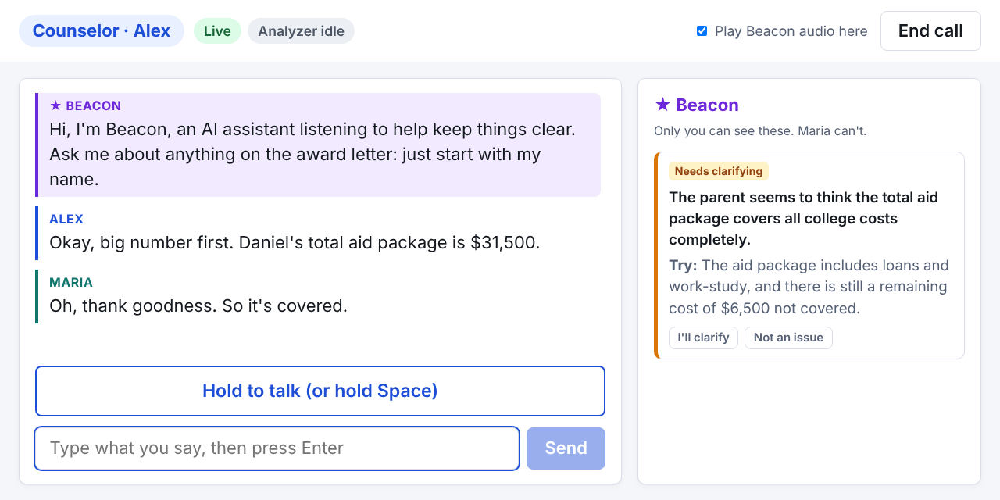
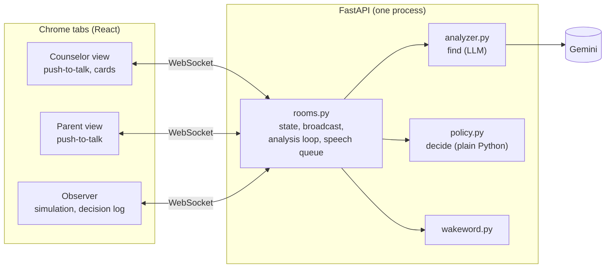

# Beacon

Beacon listens to a financial aid call between a counselor and a first-generation college
family. It asks the question the family won't ask.

When the parent's words show a misunderstanding, Beacon first shows the counselor a private card.
If the counselor clarifies, Beacon stays silent. If the counselor moves on, Beacon waits for a
pause and asks aloud, on the family's behalf. The family can also ask Beacon directly ("Beacon,
what's a Parent PLUS loan?"). After the call, Beacon writes a plain-language Family Recap that it
can read aloud.

*A real Gemini result. Maria hears "$31,500 in aid" as "it's covered". Only Alex sees the card.*

All people, the school and the award letter are fictional. The amounts are illustrative.

## Quick start

You need Python 3.11+, Node 20.19+ (or 22.12+) and Chrome.

1. Get a free Gemini API key at [Google AI Studio](https://aistudio.google.com/apikey).
2. Copy `.env.example` to `.env` and set `GEMINI_API_KEY`.
3. Run `make install`, then `make build`, then `make run`. On Windows, use
   `python tasks.py install`, `python tasks.py build` and `python tasks.py run`.
4. Open these pages in Chrome:
   - Observer: <http://localhost:8000/observer?room=demo>
   - Counselor: <http://localhost:8000/call?room=demo&role=counselor>
   - Parent: <http://localhost:8000/call?room=demo&role=parent>

Without a key, the app runs, but the status shows "analyzer unavailable" and Beacon cannot
analyze the call.

Other commands: `make dev` runs the server with reload and Vite on <http://localhost:5173>.
`make test` runs the unit and WebSocket tests (no network). `make eval` runs the offline eval.

## Try it

You can watch a scripted call, or run a live call yourself.

### Watch a scripted call

1. Open the observer and the counselor window side by side. Click once in each window: Chrome
   plays audio only in a page that you clicked.
2. In the observer, select `demo_short` and click **Play**.

The script goes through the same server code as a live call. In about two minutes, the parent
misreads two terms, hesitates after a piece of jargon, and asks Beacon a question. The counselor
window shows the private cards. The observer shows the transcript, the Decision Log with the
reason for each decision, and the Family Recap at the end. Hover over a card in the observer to
highlight its evidence in the transcript and the award letter.

"Text only" is on by default. Turn it off to hear the three voices. `demo_call` is a longer call,
and `control_call` is a call with nothing to catch.

### Run a live call

You play both roles in two windows. You can type each turn or speak it.

When one person plays both roles, set `NOTABLE_GAP_MS=6000` in `.env` and restart the server.
Beacon reads a long pause before a reply as confusion, and the time to switch windows makes most
pauses long. Remove the setting before you run a scripted call, because its planted pause is 3 s.

1. Open the counselor and parent windows side by side, and click once in each. Open the observer
   too if you want to see the Decision Log.
2. In the counselor window, click **Start call**.
3. To take a turn, type it and press Enter, or hold the spacebar and speak.
4. As the counselor, say "Daniel's total aid package is $31,500." As the parent, say "Oh, thank
   goodness, so it's covered." After a few seconds, a private card appears in the counselor
   window.
5. As the counselor, clarify ("To be clear, $14,000 of that is loans you'd pay back.") or move on
   ("Okay, let's move on to housing."). If you clarify, the card turns green. If you move on,
   Beacon asks about it at the next pause.
6. As the parent, say "Beacon, what's a Parent PLUS loan?" A question to Beacon starts with its
   name and a question word.
7. Click **End call** to see the Family Recap.

Wait a few seconds after each turn. Each analysis takes that long, and Beacon does not talk over
a new turn. Only the counselor window plays Beacon's voice. To start a clean call, click
**End call**, then **Start call**.

## How it works

The browser converts each turn to text and sends it to the server with the pause before it.
After each turn that can change something, Gemini gets the transcript, the award letter, the
glossary and the open cards. It returns JSON: possible misunderstandings with exact quotes, the
cards that the counselor has cleared up, and the parent's questions.

Gemini never decides when Beacon speaks. `policy.py` does, in plain Python. It drops a card if a
quote is not in the turn that it cites. It keeps one card per issue. It sends minor issues to the
recap instead of the call. It counts the counselor turns after a parent's question itself.

A card then goes through these steps:

1. The counselor sees it privately, with a suggested clarification. The parent sees nothing.
2. If a later analysis finds that the counselor clarified, Beacon stays silent.
3. If the counselor starts a new turn without a clarification, Beacon asks one short question at
   the next pause (0.7 s of quiet). It waits at least 20 s between two questions.
4. If Beacon cannot ask within 3 turns, the issue goes to the recap.

An unanswered question from the parent gets a card after 2 counselor turns, and Beacon asks after
the third.

On a card, the counselor can click **I'll clarify** (Beacon waits one more turn) or **Not an
issue** (Beacon never speaks about it, but an unanswered question from the family stays in the
recap). The
server logs each click with its card, as examples for tuning later.

Beacon answers questions only from the award letter and the glossary, and cites the lines that
it used. The recap lists grants, loans, work-study, the cost left to pay, deadlines and open
questions. Code checks each number in the recap against the lines that it cites.

All thresholds are in `backend/app/config.py`. An environment variable with the same name
overrides each one.

### Code map

| File | What it does |
|---|---|
| `backend/app/policy.py` | every decision (start here) |
| `backend/app/rooms.py` | WebSocket rooms, analysis loop, speech queue, timing |
| `backend/app/analyzer.py` | prompts in, checked JSON out |
| `backend/prompts/*.txt` | the analyzer, question and recap prompts |
| `backend/app/triggers.py` | the kinds of misunderstanding that Beacon looks for |
| `backend/app/models.py`, `web/src/types.ts` | data shapes and the WebSocket messages |
| `backend/app/llm.py` | Gemini client, and a fake LLM for tests |
| `backend/app/wakeword.py` | finds "Beacon" in a turn |
| `backend/app/config.py` | all settings |
| `data/` | award letter, glossary, scripted calls |
| `web/src/` | React views, speech, simulation runner |
| `backend/tests/` | unit and WebSocket tests |
| `eval/run.py` | the offline eval, writes `eval_results.md` |

## Does it work?

The eval sends scripted calls through the real analyzer and decision code. For each planted
moment, it checks what Beacon did: a card, silence, or a question aloud. The last run used
`gemini-3.5-flash-lite` on 2026-10-09, one run per script, with 0 errors.

| Script | What it tests | Result |
|---|---|---|
| `demo_call` | 7 planted moments (misreadings, unexplained jargon, an ignored question, a question to Beacon, correct restatements) and 1 moment that must stay quiet | 7/7, quiet moment quiet |
| `demo_call_stt_noise` | the same call as Chrome transcribes it: lowercase, no question marks, misheard words | 7/7, quiet moment quiet |
| `control_call` | a clear call with nothing planted | nothing spoken, 1 private card |
| `adversarial_clean` | a clear call with near misses: correct restatements, jargon explained at once, a pause before "okay" | no cards, nothing spoken |
| `live_regressions` | failures found in live testing | 3/3 |
| `live_patterns` | a relapse after a correction, a reply split over three turns, two misreadings in a row, "never mind" | 7/7 |
| `summon_checks` | 10 questions to Beacon, 2 of them not answered by the documents | 10/10 |

`demo_short`, the short call for the demo video, came after this run.
[`eval_results.md`](eval_results.md) has the full transcripts and decisions. The eval analyzes
each turn before the next turn arrives, so it does not measure live timing.

## Next steps

- Phone integration: telephony audio in, and an app for the counselor.
- More languages: clarifications and the recap in the family's language.
- Any school's documents, through retrieval instead of one fixed award letter.
- Tests with real counselors and families, to tune when Beacon speaks.
